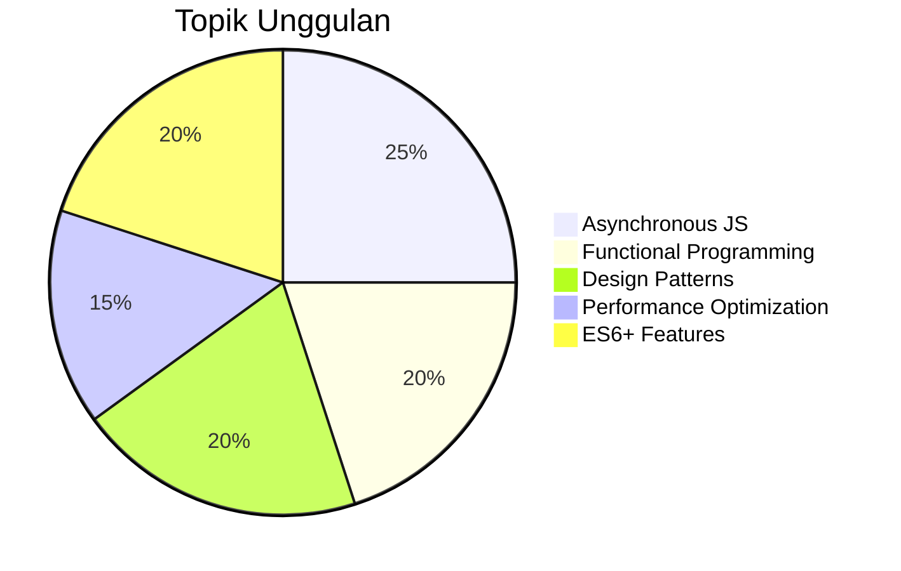
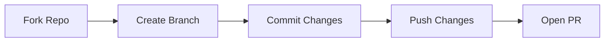

# 🚀 JavaScript Mastery: Konsep Menengah hingga Lanjut


Repositori ini merupakan panduan komprehensif untuk menguasai konsep-konsep JavaScript tingkat menengah hingga lanjut dengan pendekatan **praktis dan berbasis contoh nyata**. Dibangun untuk developer yang ingin:

- � Memperkuat fundamental JavaScript
- ⚡ Memahami konsep-konsep advance
- 🛠 Menerapkan pola-pola terbaik dalam proyek nyata

## 🌟 Fitur Unggulan



## 🧠 Konsep yang Dibahas

### 🔥 Hot Topics
- **Promise & Async/Await** - Mengelola operasi asinkron dengan elegan
- **Functional Programming** - Paradigma pemrograman yang powerful
- **Design Patterns** - Solusi untuk masalah umum pengembangan

### 📚 Daftar Lengkap
1. **Scope & Closures**
   - Lexical scope
   - Module pattern
   - Factory functions

2. **OOP in JS**
   - Prototype chain
   - ES6 Classes
   - Private fields

3. **Functional Programming**
   - Pure functions
   - Currying
   - Function composition

4. **Asynchronous JS**
   - Promise chaining
   - Error handling
   - Parallel execution

5. **Performance**
   - Memoization
   - Debounce/Throttle
   - Lazy loading

## 🛠 Cara Menggunakan

### 🚀 Quick Start
```bash
git clone https://github.com/username/repo.git
cd repo
npm install
npm run dev
```

### 🧪 Running Examples
```javascript
// Contoh penggunaan memoization
const memoizedFn = memoize(expensiveCalculation);
console.log(memoizedFn(5)); // Hitung
console.log(memoizedFn(5)); // Pakai cache
```

### 📊 Benchmark
| Approach | Time (ms) |
|----------|----------|
| Regular  | 1200     |
| Optimized| 200      |

## 💡 Contoh Kode

### Async/Await Pattern
```javascript
async function fetchUserData() {
  try {
    const [user, posts] = await Promise.all([
      fetch('/user'),
      fetch('/posts')
    ]);
    return { user, posts };
  } catch (error) {
    console.error('Fetch error:', error);
    throw error;
  }
}
```

### Functional Composition
```javascript
const transformData = pipe(
  filterActiveUsers,
  sortByDate,
  paginateResults
);

const result = transformData(rawData);
```

## 🏆 Kenapa Memilih Repo Ini?

✅ **Kode Praktis** - Langsung bisa diaplikasikan  
✅ **Dokumentasi Lengkap** - Penjelasan mendalam setiap konsep  
✅ **Contoh Nyata** - Kasus-kasus dunia nyata  
✅ **Performance Tips** - Optimasi kode JavaScript  

## 🤝 Berkontribusi

Kami terbuka untuk kontribusi! Ikuti langkah berikut:

1. Fork repo
2. Buat branch baru
3. Commit perubahan
4. Push ke branch
5. Buat Pull Request



## 📜 Lisensi

MIT License - Bebas digunakan untuk proyek pribadi maupun komersial

---

<div align="center">
  <h3>🔥 Ready to Level Up Your JS Skills? 🔥</h3>
</div>
